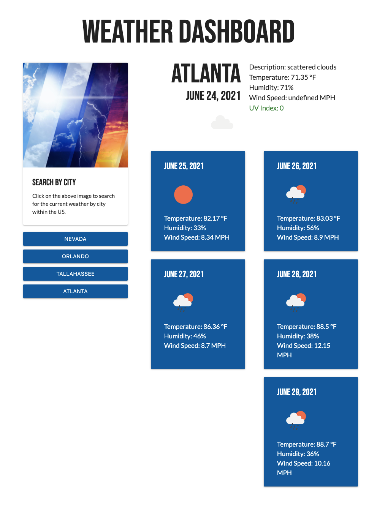

# Challenge 6: Weather-Dashboard

https://theconversation.com/how-world-war-i-changed-the-weather-for-good-74471

## Description

This application is meant to apply the knowledge and skills acquired from working with JavaScript and Server-Side APIs to create a weather dashboard that can run in the browser and feature dynamically updated HTML and CSS. It's intended use is for travelers that want to see the weather outlook for multiple cities so that they may plan a trip accordingly.

## Challenge Requirements

- Form inputs to search for a city that presents the current and future conditions for that city and that city is added to the search history
- The current weather conditions for that city must include the city name, the date, an icon representation of weather conditions, the temperature, the humidity, the wind speed, and the UV index
- The UV index must have a color that indicates whether the conditions are favorable, moderate, or severe
- The future weather conditions for that city should be a 5-day forecast that displays the date, an icon representation of weather conditions, the temperature, the wind speed, and the humidity
- The user should be able to click on a city in the search history and again be presented with current and future conditions for that city

### Final Website Screenshot

### Website URL

https://jennmenji.github.io/Challenge6-Weather-Dashboard/
